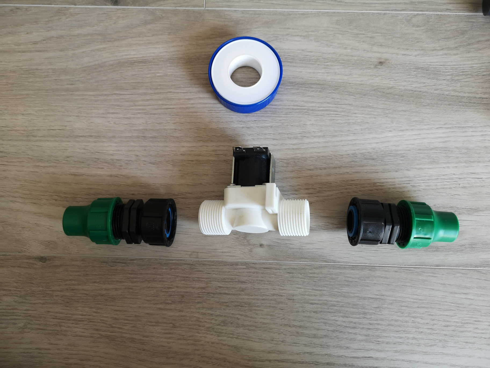
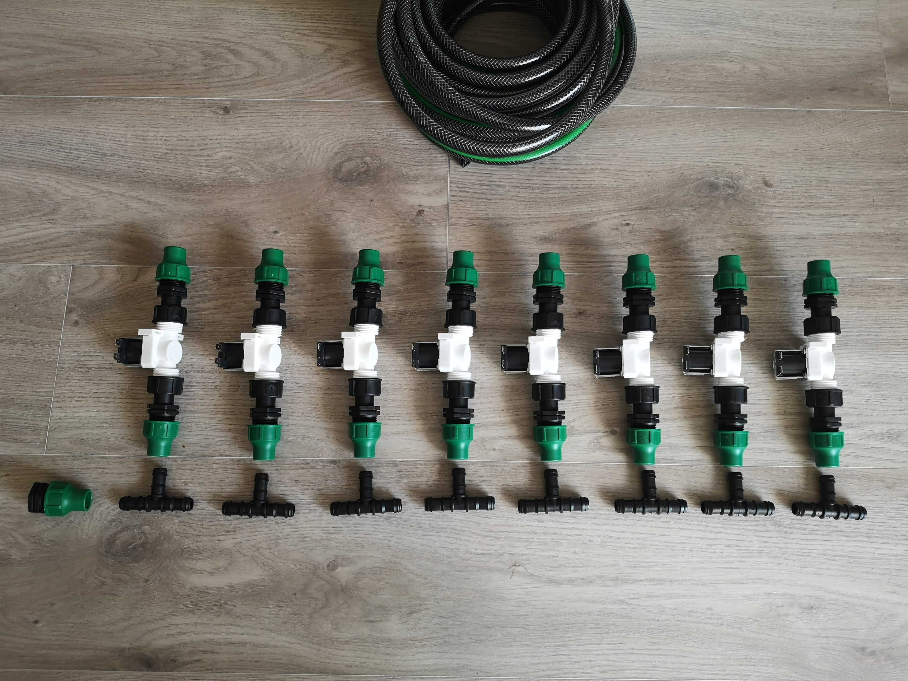
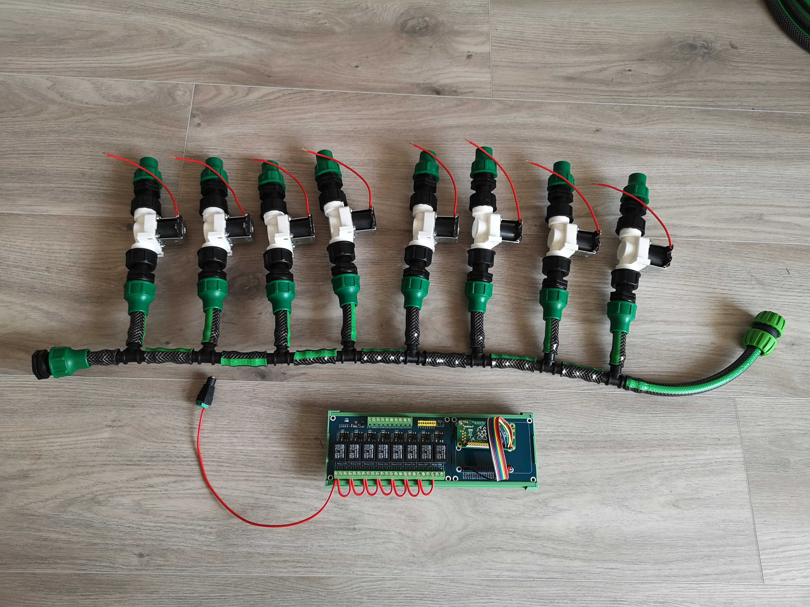
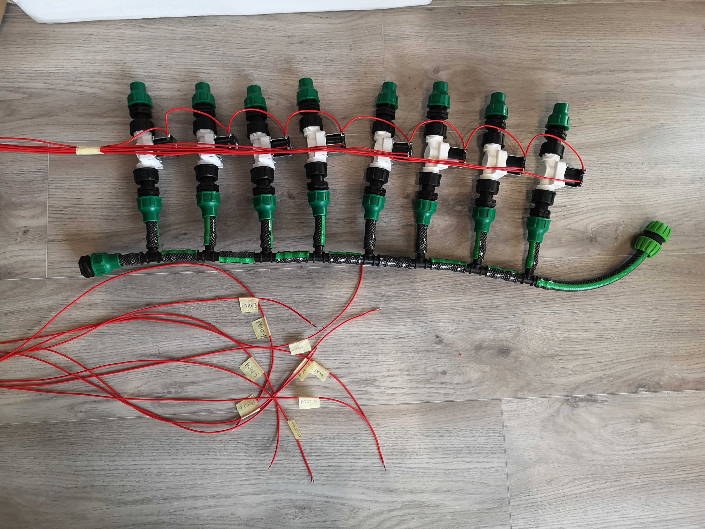
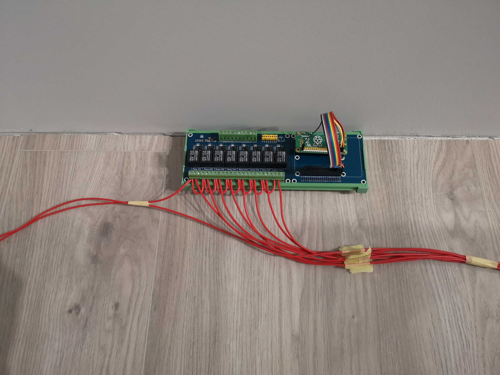

# Garden Pi

Simple watering system based on RPi, relays and solenoid valves.
In this repo you will find a single python script for switching relays connected to RPi. 
This script can be installed as a CRON job to turn your pile of wires and parts into industry 
standard watering scheduler with basically unlimited schedules.

# Wiring

Here should be some elegant wiring diagram, but all I have right now are a bunch of photos I made
when assembling the thing.

### Valve plumbing

The solenoid valve I found had a 3/4" threading, so I had to reduce it to my 1/2" garden hose I had 
in my garage. I found a 3/4" thread reducer to 1/2 garden hose quick coupler for cheap so I took a
handful of those. Also, it's worth using the teflon tape to make a good, sealed connection on plastic 
threading.

### Connecting valves

I connect the valves in parallel, and I'm planning to open one-at-a-time tops. My water pressure suck 
balls, so it's the best I can go with. The 3-way joints will be connected using small pieces of my
garden hose, but I recon using some rubber seals or clamp band of some sorts on the joint. Zip tie 
will be fine as well.

I've finished the valve series with end cap to make it easily extendable.

### Wiring the common connections

Now the fun part. I've started the wiring with a common connections. The valves will have one pin
soldered together (not visible on this picture yet - the short wires will be connected to next valve)
and the relay module has its relays connected together in the same manner. Common wire on valve
series will be connected to `+12V` and the common wire on relay module will be connected to `-12V`
(or the other way - doesn't matter)

### Wiring separate valves

Each valve has to be driven by separate relay, and those needs to be connected together. I've used
~10m wires since I will keep my relay module and RPi in a dry room and the valves will be kept
outside where will be exposed to high humidity environment.

# Parts

### Electrical

- Raspberry Pi Zero W [link](https://botland.com.pl/moduly-i-zestawy-raspberry-pi-zero/8330-raspberry-pi-zero-w-512mb-ram-wifi-bt-41-5904422311513.html)
- Solenoid valve - SparkFun ROB-10456 - 12V, 3/4" [link](https://botland.com.pl/zawory/1993-zawor-elektromagnetyczny-12v-3-4-sparkfun-rob-10456.html)
- Relay Hat for Raspberry Pi - Waveshare 15423 [link](https://botland.com.pl/pozostale-moduly-do-raspberry-pi/13301-relay-hat-dla-raspberry-pi-8-przekaznikow-z-optoizolacja-styki-5a250vac30vdc-cewka-5v-waveshare-15423-5904422320423.html)
- Impulse power supply - Huntkey 12V/2A with DC 5,5/2,1mm [link](https://botland.com.pl/zasilacze-dogniazdkowe/13908-zasilacz-impulsowy-huntkey-12v2a-wtyk-dc-5521mm.html)
- Raspberry Pi power supply - 5V/2,5A [link](https://botland.com.pl/zasilacze-dogniazdkowe/14515-zasilacz-microusb-5v25a-do-raspberry-pi-3b3a3b2bzero-5903351241410.html)
- DC 5,5x2,1mm socket [link](https://botland.com.pl/szybkozlacza/1804-gniazdo-dc-55x21mm-z-szybkozlaczem.html)

### Hydraulic

- Garden hose 1/2"
- Quick coupler: from 3/4" thread to garden hose 1/2"
- Teflon tape
- 3-way joint for 1/2" garden hose
- End-cap for 1/2" garden hose